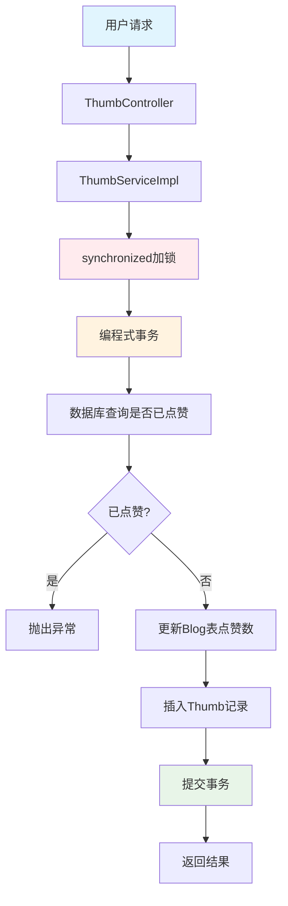
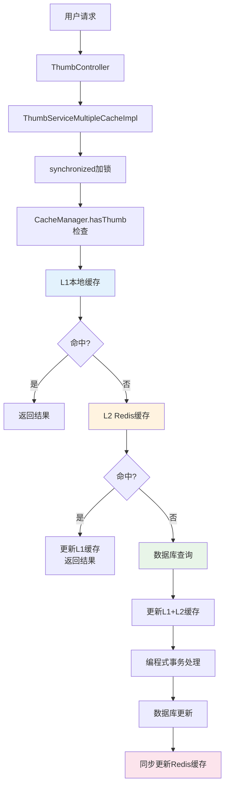
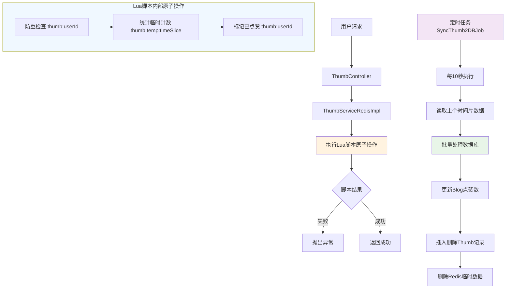
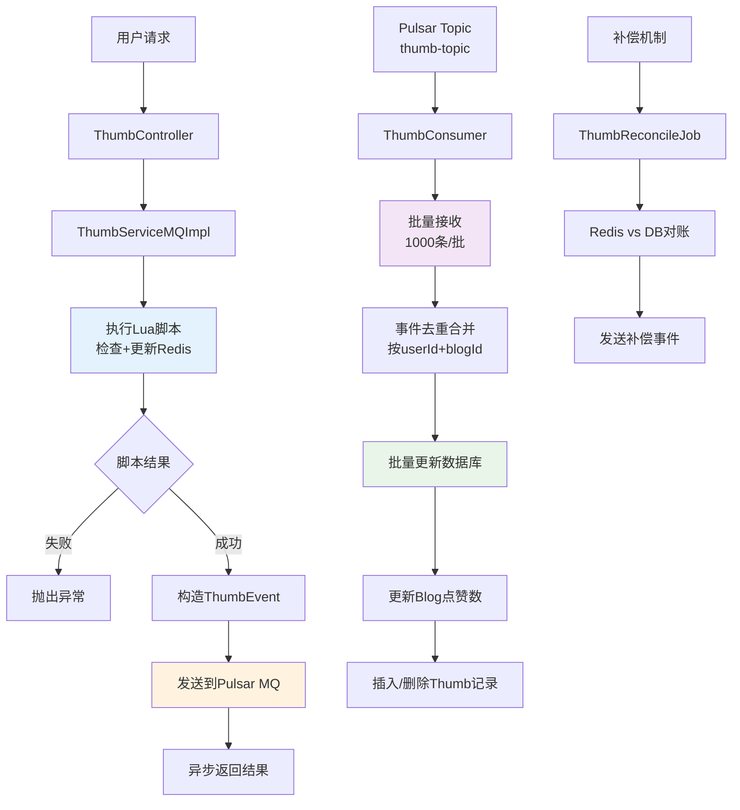
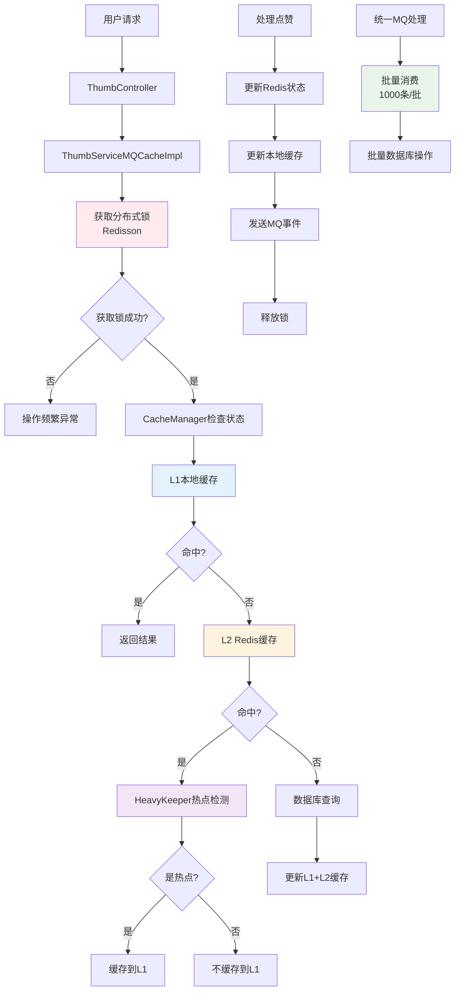

# 点赞系统架构演进录 - 从单体到分布式的完整实践

> 从基础实现到高性能分布式架构的完整思路展示

## 项目概述

本项目是一个高性能点赞系统的实现，展示了如何从简单的单体架构逐步演进到支持高并发的分布式系统。通过 5 个不同的实现方案，展现了项目中对于性能优化的思路和思考。最后使用 Jmeter 针对每一种实现进行压力测试 以此对比不同实现的 Pros and cons

### 基本解决思路

本项目通过 **5 种不同的架构方案**,给出一个完整的点赞系统的实现

1. 从最基础的数据库直写开始
2. 引入多级缓存提升读性能
3. 使用 Redis 优化写性能
4. 通过 MQ 实现读写分离
5. 多级缓存 + MQ 解偶

### 业务流程

#### 核心业务逻辑

```java
点赞业务流程：
1. 用户身份验证
   └── 检查用户是否已登录
   └── 获取当前用户信息

2. 重复性检查
   └── 查询用户是否已对该博客点赞
   └── 防止重复点赞行为

3. 原子性操作
   └── 更新博客点赞总数 (+1)
   └── 插入用户点赞记录
   └── 保证操作的原子性

4. 结果反馈
   └── 返回操作成功状态
   └── 前端更新界面显示
```

#### sql 表

```sql
-- 博客表
Blog {
    id: 博客ID
    userID: 创建用户ID
    title: 博客标题
    content: 博客内容
    coverImg: 博客图片
    thumbCount: 点赞总数
    createTime: 创建时间
    updateTime: 修改时间
}

-- 用户表
User {
    id: 用户ID
    username: 用户名
}

-- 点赞记录表
Thumb {
    id: 记录ID
    userId: 用户ID
    blogId: 博客ID
    createTime: 点赞时间

    UNIQUE(userId, blogId) -- 唯一约束：防止重复点赞
}
```

### 技术栈

- **后端框架**: Spring Boot 3.x
- **数据库**: MySQL 8.0 + MyBatis Plus
- **缓存**: Redis(Lua 脚本) + Caffeine (多级缓存) + HeavyKeeper 实现
- **消息队列**: Apache Pulsar
- **分布式锁**: Redisson
- **多线程**：java21 虚拟线程

## 性能演进历程

| 方案             | QPS    | 响应时间 | 性能提升 | 架构复杂度 | 适用场景     |
| ---------------- | ------ | -------- | -------- | ---------- | ------------ |
| 基础实现         | 20.5   | 1151ms   | 基准     | ⭐         | 小规模应用   |
| 多级缓存(冷启动) | 284.4  | 1109ms   | 13.9 倍  | ⭐⭐       | 缓存预热阶段 |
| 多级缓存(热启动) | 946.0  | 137ms    | 46.1 倍  | ⭐⭐       | 读多写少     |
| Redis 优化       | 1282.6 | 23ms     | 62.6 倍  | ⭐⭐⭐     | 中高并发     |
| MQ 解耦          | 894.8  | 162ms    | 43.7 倍  | ⭐⭐⭐⭐   | 异步高并发   |
| 多级缓存+MQ 解偶 | 655.3  | 359ms    | 32.0 倍  | ⭐⭐⭐⭐⭐ | 复杂业务场景 |

---

## 方案一：点赞基础实现

### 核心思路

最简单直接的实现方式，直接读写数据库，通过 synchronized 保证线程安全。

### 架构图



### 核心代码

```java
@Override
public Boolean doThumb(DoThumbRequest doThumbRequest, HttpServletRequest request) {
    User loginUser = userService.getLoginUser(request);

    // synchronized 锁，防止一个用户重复发起点赞
    synchronized (loginUser.getId().toString().intern()) {
        return transactionTemplate.execute(status -> {
            // 1. 检查是否已点赞
            boolean exists = this.lambdaQuery()
                    .eq(Thumb::getUserId, loginUser.getId())
                    .eq(Thumb::getBlogId, blogId)
                    .exists();

            if (exists) {
                throw new RuntimeException("用户已点赞");
            }

            // 2. 更新博客点赞数
            boolean update = blogService.lambdaUpdate()
                    .eq(Blog::getId, blogId)
                    .setSql("thumbCount = thumbCount + 1")
                    .update();

            // 3. 插入点赞记录
            Thumb thumb = new Thumb();
            thumb.setUserId(loginUser.getId());
            thumb.setBlogId(blogId);

            return update && this.save(thumb);
        });
    }
}
```

### 解决的问题

- ✅ 实现基本的点赞功能
- ✅ synchronized 锁实现单体应用的数据一致性
- ✅ 防止重复点赞

### 存在的问题

- ❌ **性能瓶颈**: 每次操作都要查询数据库 点赞信息非批量入库
- ❌ **并发限制**: synchronized 锁限制了并发能力
- ❌ **响应延迟**: 数据库 IO 成为主要延迟源

### 性能指标

- **QPS**: 20.5
- **响应时间**: 1151ms (平均), 2806ms (P99)
- **数据库压力**: 高 (每次请求都访问)

---

## 方案二：多级缓存读优化

### 核心思路

为了解决每次通过查询数据库去判断是否【已点赞】 可以引入缓存的思想
引入多级缓存架构，将热点数据缓存在内存中，大幅提升读操作性能。使用 HeavyKeeper 算法实现热点检测

热点检测的算法介绍 请看我的博客
[热点检测中的算法介绍 Lossy Counting、Count-Min Sketch 、HeavyKeeper 以及 HeavyKeeper 的 java 实现](https://blog.csdn.net/qq_44716086/article/details/148838377?fromshare=blogdetail&sharetype=blogdetail&sharerId=148838377&sharerefer=PC&sharesource=&sharefrom=from_link)

### 架构图



### 多级缓存策略

```java
public Object get(String hashKey, String key) {
    String compositeKey = buildCacheKey(hashKey, key);

    // 1. L1本地缓存查询
    Object value = localCache.getIfPresent(compositeKey);
    if (value != null) {
        hotKeyDetector.add(key, 1); // 记录访问
        return value;
    }

    // 2. L2 Redis缓存查询
    Object redisValue = redisTemplate.opsForHash().get(hashKey, key);
    if (redisValue != null) {
        AddResult addResult = hotKeyDetector.add(key, 1);

        // 3. 热点检测：只有热点数据才缓存到L1
        if (addResult.isHotKey()) {
            localCache.put(compositeKey, redisValue);
        }
        return redisValue;
    }

    // 3. 数据库查询
    Object dbValue = queryFromDatabase(hashKey, key);
    if (dbValue != null) {
        redisTemplate.opsForHash().put(hashKey, key, dbValue);
    }

    return dbValue;
}
```

### 热点检测算法

使用**HeavyKeeper 算法**实现智能热点检测：

- **准确性**: 95%+的热点识别准确率
- **内存效率**: 固定内存占用，不会随数据量线性增长
- **衰减机制**: 自动淘汰冷数据

### 解决的问题

- ✅ **读性能提升**: 数据从缓存中读取
- ✅ **智能缓存**: 只缓存真正的热点数据
- ✅ **自动管理**: 无需人工配置热点数据

### 为什么这样去优化

1. **二八定律**: 20%的博客占据 80%的访问量
2. **时间局部性**: 热点博客在短时间内会被反复访问
3. **空间局部性**: 热点用户的点赞行为相对集中

### 性能指标

- **QPS**: 284.4（冷启动） → 946.0（热启动）
- **响应时间**: 1109ms（冷启动） → 137ms（热启动）
- **性能提升**: 相比基础实现 13.9-46.1 倍
- **缓存效应**: 冷热差异 232%，体现缓存预热重要性

---

## 方案三：Redis 读写优化

### 核心思路

使用 Redis 作为存储，点赞操作的临时信息暂存于 redis 中，通过 Lua 脚本保证操作原子性，采用时间片+定时任务去批量入库，引入补偿机制去保证最终数据的一致性

### 架构图



### 时间片机制

```java
private String getTimeSlice() {
    DateTime nowDate = DateUtil.date();
    // 将时间精确到10秒粒度：11:20:23 -> 11:20:20
    return DateUtil.format(nowDate, "HH:mm:") + (DateUtil.second(nowDate) / 10) * 10;
}
```

### Lua 脚本原子操作

```lua
-- 点赞Lua脚本
local tempThumbKey = KEYS[1]  -- 临时计数键 thumb:temp:{timeSlice}
local userThumbKey = KEYS[2]  -- 用户状态键 thumb:{userId}
local userId = ARGV[1]
local blogId = ARGV[2]

-- 1. 防重检查 使用 用户状态键
if redis.call('HEXISTS', userThumbKey, blogId) == 1 then
    return -1  -- 已点赞
end

-- 2. 原子更新
local hashKey = userId .. ':' .. blogId
local oldNumber = tonumber(redis.call('HGET', tempThumbKey, hashKey) or 0)
local newNumber = oldNumber + 1

-- 3. 写入数据 临时计数键 + 用户状态键  临时计数键会被用来统计在某个时间窗口下的点赞数
redis.call('HSET', tempThumbKey, hashKey, newNumber)
redis.call('HSET', userThumbKey, blogId, 1)

return 1  -- 成功
```

### 定时任务 + 定时补偿 实现数据最终的一致性

#### 定时任务机制

**SyncThumb2DBJob**: 每 10 秒执行一次，负责将 Redis 中的临时数据批量同步到数据库 使用 java21 的虚拟线程删除 临时键

java 21 中虚拟线程的使用请查看:
[java 21 虚拟线程 vs 传统线程 原理分析以及具体测试例子去分析性能提升](https://blog.csdn.net/qq_44716086/article/details/148713500?fromshare=blogdetail&sharetype=blogdetail&sharerId=148713500&sharerefer=PC&sharesource=&sharefrom=from_link)

```java
@Scheduled(fixedRate = 10000) // 每10秒执行
public void syncThumbData() {
    // 1. 获取上一个时间片的key
    String lastTimeSlice = getLastTimeSlice();
    String tempKey = "thumb:temp:" + lastTimeSlice;

    // 2. 读取Redis中的临时数据
    Map<String, String> tempData = redisTemplate.opsForHash().entries(tempKey);

    if (!tempData.isEmpty()) {
        // 3. 批量处理数据库操作
        List<ThumbBatchOperation> operations = parseOperations(tempData);

        // 4. 批量更新博客点赞数
        updateBlogThumbCount(operations);

        // 5. 批量插入/删除点赞记录
        batchUpdateThumbRecords(operations);

        // 6. 虚拟线程异步删除已处理的临时数据
        Thread.startVirtualThread(() -> {
            redisTemplate.delete(tempKey);
        });

        log.info("同步完成，处理数据: {}条", tempData.size());
    }
}
```

#### 补偿机制

为了确保数据的一致性 需要引入补偿对账机制 去 检查是否 redis 中还存在没有处理的临时点赞数据 如果有 则重新入库

**SyncThumb2DBCompensatoryJob**: 每天凌晨 2 点执行，检查 redis 中是否还存在临时点赞记录 thumb:temp:{timeSlice}
如果有就重新将临时点赞记录入库 然后删除这条记录

```java
@Scheduled(cron = "0 0 2 * * *")
public void run() {
    log.info("开始补偿数据");
    Set<String> thumbKeys = redisTemplate.keys(RedisKeyUtil.getTempThumbKey("") + "*");
    Set<String> needHandleDataSet = new HashSet<>();
    // 检查是否还有 临时点赞记录 thumb:temp:{timeSlice}
    thumbKeys.stream().filter(ObjUtil::isNotNull).forEach(thumbKey ->
        needHandleDataSet.add(thumbKey.replace(ThumbConstant.TEMP_THUMB_KEY_PREFIX.formatted(""), "")));

    if (CollUtil.isEmpty(needHandleDataSet)) {
        log.info("没有需要补偿的临时数据");
        return;
    }
    // 补偿数据
    for (String date : needHandleDataSet) {
        syncThumb2DBJob.syncThumb2DBByDate(date);
    }
    log.info("临时数据补偿完成");
}
```

### 解决的问题

- ✅ **原子性保证**: Lua 脚本确保操作原子性
- ✅ **高性能写入**: Redis 内存操作，毫秒级响应
- ✅ **批量处理**: 每隔 10s 定时任务同步数据
- ✅ **最终一致性**: 异步同步保证数据最终一致

### 为什么这样去优化

1. **读写分离**: 读操作走 Redis，写操作也走 redis,通过定时任务批量入库
2. **时间窗口**: 将连续的操作聚合到时间片中
3. **批量优化**: 利用数据库批量操作的性能优势

### redis 中的结构为何这样去设置

为何需要使用 thumb:temp:{timeSlice} thumb:{userId}类型的数据 请参考我的博客
[Redis 常用数据结构以及多并发场景下的使用分析：Hash 类型](https://blog.csdn.net/qq_44716086/article/details/149165461?fromshare=blogdetail&sharetype=blogdetail&sharerId=149165461&sharerefer=PC&sharesource=qq_44716086&sharefrom=from_link)

如果你对 Redis 中的其他常见数据结构不了解 请参考我的博客：

- [Redis 常用数据结构以及多并发场景下的使用分析：String 类型](https://blog.csdn.net/qq_44716086/article/details/149141641?fromshare=blogdetail&sharetype=blogdetail&sharerId=149141641&sharerefer=PC&sharesource=&sharefrom=from_link)
- [Redis 常用数据结构以及多并发场景下的使用分析：Hash 类型](https://blog.csdn.net/qq_44716086/article/details/149165461?fromshare=blogdetail&sharetype=blogdetail&sharerId=149165461&sharerefer=PC&sharesource=qq_44716086&sharefrom=from_link)
- [Redis 常用数据结构以及多并发场景下的使用分析：List 类型](https://blog.csdn.net/qq_44716086/article/details/149171366?fromshare=blogdetail&sharetype=blogdetail&sharerId=149171366&sharerefer=PC&sharesource=&sharefrom=from_link)
- [Redis 常用数据结构以及多并发场景下的使用分析：Set 类型](https://blog.csdn.net/qq_44716086/article/details/149179192?fromshare=blogdetail&sharetype=blogdetail&sharerId=149179192&sharerefer=PC&sharesource=&sharefrom=from_link)
- [Redis 常用数据结构以及多并发场景下的使用分析：Sorted List 类型](https://blog.csdn.net/qq_44716086/article/details/149198864?fromshare=blogdetail&sharetype=blogdetail&sharerId=149198864&sharerefer=PC&sharesource=&sharefrom=from_link)

### 性能指标

- **QPS**: 1282.6
- **响应时间**: 23ms（平均），75ms（P99）
- **性能提升**: 相比基础实现 62.6 倍的提升
- **数据库压力**: 降低 90%（批量时间片处理）

---

## 方案四：消息队列解耦

### 核心思路

引入 Apache Pulsar 消息队列，实现读写完全分离。写操作立即返回，通过 MQ 异步处理数据库更新，支持高并发场景。使用定时任务补偿机制解决 redis 和消息队列的潜在不一致性。

### 架构图



### 批量消费优化

```java
@PulsarListener(
    topics = "thumb-topic",
    batch = true,
    subscriptionType = SubscriptionType.Shared
)
public void processBatch(List<Message<ThumbEvent>> messages) {
    // 1. 事件去重：相同用户+博客的多次操作合并
    Map<Pair<Long, Long>, ThumbEvent> latestEvents = messages.stream()
        .map(Message::getValue)
        .collect(Collectors.groupingBy(
            e -> Pair.of(e.getUserId(), e.getBlogId()),
            Collectors.collectingAndThen(
                Collectors.toList(),
                list -> {
                    list.sort(Comparator.comparing(ThumbEvent::getEventTime));
                    // 奇数个事件表示最终状态为点赞，偶数个表示未点赞
                    return list.size() % 2 == 0 ? null : list.get(list.size() - 1);
                }
            )
        ));

    // 2. 批量数据库操作
    batchUpdateDatabase(latestEvents);
}
```

### 补偿机制 ThumbReconcileJob

在 MQ 解耦方案中，需要处理 redis 和 发送消息之间的 【不同步】问题
例如 redis 已经 保存了点赞信息 然后系统宕机 消息队列没有发送消息
最终会导致 redis 和消息队列处理的 不一致

此时需要补偿对账机制 保证数据的一致性 和 可靠性

对账定期（比如每天凌晨 2 点）运行，执行以下步骤：

1. 扫描 Redis 用户的点赞记录
2. 从数据库获取对应用户的点赞记录
3. 比对两者差异
4. 对差异数据发送补偿事件到消息队列，由消费者重新处理

这样即使在 Redis 写入成功但由于种种原因消息发送失败的异常情况下，也能保证数据的一致性。

```java
/**
 * 定时任务入口（每天凌晨2点执行）
 */
@Scheduled(cron = "0 0 2 * * ?")
public void run() {
    long startTime = System.currentTimeMillis();

    // 1. 获取该分片下的所有用户ID
    Set<Long> userIds = new HashSet<>();
    String pattern = ThumbConstant.USER_THUMB_KEY_PREFIX + "*";
    try (Cursor<String> cursor = redisTemplate.scan(ScanOptions.scanOptions().match(pattern).count(1000).build())) {
        while (cursor.hasNext()) {
            String key = cursor.next();
            Long userId = Long.valueOf(key.replace(ThumbConstant.USER_THUMB_KEY_PREFIX, ""));
            userIds.add(userId);
        }
    }

    // 2. 逐用户比对
    userIds.forEach(userId -> {
        Set<Long> redisBlogIds = redisTemplate.opsForHash()
            .keys(ThumbConstant.USER_THUMB_KEY_PREFIX + userId)
            .stream()
            .map(obj -> Long.valueOf(obj.toString()))
            .collect(Collectors.toSet());

        Set<Long> mysqlBlogIds = Optional.ofNullable(thumbService.lambdaQuery()
                .eq(Thumb::getUserId, userId)
                .list())
            .orElse(new ArrayList<>())
            .stream()
            .map(Thumb::getBlogId)
            .collect(Collectors.toSet());

        // 3. 计算差异（Redis有但MySQL无）
        Set<Long> diffBlogIds = Sets.difference(redisBlogIds, mysqlBlogIds);

        // 4. 发送补偿事件
        sendCompensationEvents(userId, diffBlogIds);
    });

    log.info("对账任务完成，耗时 {}ms", System.currentTimeMillis() - startTime);
}

/**
 * 发送补偿事件到Pulsar
 */
private void sendCompensationEvents(Long userId, Set<Long> blogIds) {
    blogIds.forEach(blogId -> {
        ThumbEvent thumbEvent = new ThumbEvent(userId, blogId, ThumbEvent.EventType.INCR, LocalDateTime.now());
        pulsarTemplate.sendAsync("thumb-topic", thumbEvent)
            .exceptionally(ex -> {
                log.error("补偿事件发送失败: userId={}, blogId={}", userId, blogId, ex);
                return null;
            });
    });
}
```

### 容错与补偿机制

- **重试策略**: 指数退避重试
- **死信队列**: 处理失败的消息
- **对账补偿**: 定时对比 Redis 和 DB 数据
- **幂等性**: 支持消息重复消费

### 解决的问题

- ✅ **系统解耦**: 读写操作完全分离 方便扩展业务
- ✅ **削峰填谷**: MQ 缓冲突发流量
- ✅ **容错能力**: 完善的重试和补偿机制

### 为什么这样去优化

redis 的 lua 脚本中是不支持复杂的业务操作的，例如点赞后还存在其他业务代码，此时 redis 的 lua 脚本是不能执行的，这时候就需要使用 MQ 将点赞逻辑拆分出去

1. **异步化**: 将耗时的数据库操作异步化
2. **批量化**: 利用 MQ 的批量处理能力
3. **去重合并**: 减少无效的数据库操作

### 性能指标

- **QPS**: 894.8（比 Redis 方案低 30%）
- **响应时间**: 162ms（平均），524ms（P99）
- **性能提升**: 相比基础实现 43.7 倍
- **队列开销**: 相比纯 Redis 方案有明显的队列开销

---

## 方案五：多级缓存 + MQ 队列

### 核心思路

结合多级缓存和消息队列的优势，使用分布式锁保证一致性，实现读写性能的双重优化。CacheManager 自动管理热点数据，MQ 处理所有写操作。

### 架构图



### 核心代码架构

```java
@Service("thumbService")
public class ThumbServiceMQCacheImpl implements ThumbService {

    private final CacheManager cacheManager;        // 多级缓存
    private final RedissonClient redissonClient;    // 分布式锁
    private final PulsarTemplate pulsarTemplate;    // 消息队列

    @Override
    public Boolean doThumb(DoThumbRequest request, HttpServletRequest httpRequest) {
        String lockKey = "thumb:lock:" + userId + ":" + blogId;
        RLock lock = redissonClient.getLock(lockKey);

        try {
            if (lock.tryLock(200, TimeUnit.MILLISECONDS)) {
                // 1. 多级缓存检查
                Boolean exists = this.hasThumb(blogId, userId);
                if (exists) {
                    throw new RuntimeException("用户已点赞");
                }

                // 2. 更新Redis和本地缓存
                redisTemplate.opsForHash().put(userThumbKey, blogId.toString(), timestamp);
                cacheManager.put(userThumbKey, blogId.toString(), timestamp);

                // 3. 异步MQ处理
                pulsarTemplate.sendAsync("thumb-topic", thumbEvent);

                return true;
            }
        } finally {
            lock.unlock();
        }
    }

    @Override
    public Boolean hasThumb(Long blogId, Long userId) {
        // CacheManager自动处理：L1 -> L2 -> DB -> 热点检测 -> 智能缓存
        Object result = cacheManager.get(userThumbKey, blogId.toString());
        return result != null && !result.equals(UN_THUMB_CONSTANT);
    }
}
```

### 多级缓存管理

CacheManager 实现了多级缓存的缓存策略：

1. **统一读取路径**: 所有查询都走相同的缓存层级
2. **智能热点检测**: HeavyKeeper 算法自动识别热点
3. **自动缓存决策**: 热点数据自动缓存到 L1，冷数据不污染缓存
4. **透明化管理**: 业务代码无需关心缓存策略

### 分布式锁优化

```java
// 精确锁粒度：用户+博客维度
String lockKey = "thumb:lock:" + userId + ":" + blogId;
RLock lock = redissonClient.getLock(lockKey);

// 快速失败：避免用户等待
if (lock.tryLock(200, TimeUnit.MILLISECONDS)) {
    // 业务逻辑
} else {
    throw new RuntimeException("操作过于频繁，请稍后再试");
}
```

### 解决的问题

- ✅ **高扩展**: 支持水平扩展
- ✅ **智能化**: 全自动的缓存和热点管理
- ✅ **高可用**: 分布式架构，单点故障不影响服务

### 为什么这样去优化

1. **读写分离**: 读操作走多级缓存，写操作走 MQ 异步
2. **多级缓存热点**: 系统自动适应热点数据变化
3. **架构统一**: 统一的数据流和处理路径

### 性能指标

- **QPS**: 655.3
- **响应时间**: 359ms（平均），1180ms（P99）
- **性能提升**: 相比基础实现 32.0 倍

---

## 方案六：TiDB 替代 MySQL

### 核心思路

当点赞数量越来越多，我们的数据库越来越大，如何进一步去优化呢？此时可以想到分库分表。但传统的分库分表存在很高的研发和运维成本，需要一个支持分布式的数据库解决方案。

**TiDB** 是一个兼容 MySQL 协议的分布式数据库，能够提供水平扩展、强一致性和高可用性，完美解决了传统分库分表的痛点。

### TiDB vs 传统分库分表

| 对比维度       | 传统分库分表           | TiDB 方案           |
| -------------- | ---------------------- | ------------------- |
| **开发复杂度** | 高（需要分片逻辑）     | 低（透明分片）      |
| **SQL 兼容性** | 受限（跨分片查询困难） | 完全兼容 MySQL      |
| **扩容操作**   | 复杂（需要数据迁移）   | 简单（在线扩容）    |
| **事务支持**   | 受限（分布式事务复杂） | 完整（分布式 ACID） |
| **运维成本**   | 高（多套数据库）       | 低（统一管理）      |
| **数据一致性** | 最终一致性             | 强一致性            |

需要读者自行探索 如何使用 TiDB 去切换数据库

## 性能测试

### 统一测试配置

#### 测试前准备工作

在开始性能测试之前，需要先进行以下准备步骤：

**步骤 1：创建测试用户数据**

```java
// 运行 ThumbBackendApplicationTests.java 中的 addUser() 方法
@Test
void addUser() {
    for (int i = 0; i < 50000; i++) {
        User user = new User();
        user.setUsername(RandomUtil.randomString(6));
        userService.save(user);
    }
}
```

此步骤会在数据库中创建 50,000 个虚拟用户，为后续测试提供足够的用户基数。

**步骤 2：生成用户登录 Session**

```java
// 运行 ThumbBackendApplicationTests.java 中的 testLoginAndExportSessionToCsv() 方法
@Test
void testLoginAndExportSessionToCsv() throws Exception {
    List<User> list = userService.list();

    try (PrintWriter writer = new PrintWriter(new FileWriter("session_output.csv", true))) {
        writer.println("userId,sessionId,timestamp");

        for (User user : list) {
            // 模拟用户登录，获取Session
            MvcResult result = mockMvc.perform(get("/user/login")
                            .param("userId", String.valueOf(user.getId()))
                            .contentType(MediaType.APPLICATION_JSON))
                    .andReturn();

            // 提取Session信息并保存到CSV文件
            String sessionId = extractSessionFromResponse(result);
            writer.printf("%d,%s,%s%n", user.getId(), sessionId, LocalDateTime.now());
        }
    }
}
```

这一步骤的作用：

- ✅ **用户登录**: 为所有测试用户执行登录操作
- ✅ **Session 存储**: 将用户 Session 信息保存到 Redis 中
- ✅ **CSV 导出**: 生成`session_output.csv`文件，包含 userId 和对应的 sessionId
- ✅ **认证准备**: 后续测试请求需要携带有效 Session 才能通过身份验证

**步骤 3：JMeter 配置 Session**

```bash
# 将生成的 session_output.csv 文件导入到JMeter中
# 配置CSV Data Set Config组件读取用户Session信息
# 确保每个测试请求都携带有效的用户Session
```

#### 测试参数配置

完成上述准备工作后，所有方案采用**完全相同**的测试参数，确保公平对比：

```yaml
线程数: 400
启动时间: 15秒 (Ramp-up Period)
循环次数: 50
总请求数: 20,000
用户数据: 50,000个预生成用户
Session管理: Redis存储，CSV文件配置
```

### 详细测试结果

**基础实现**


**多级缓存（冷启动）**


**多级缓存(热启动)**


**Redis 优化**


**MQ 解耦**


**多级缓存+MQ 解偶**


| 方案                 | QPS    | 平均响应时间 | P90 响应时间 | P99 响应时间 | 错误率 | 性能提升 |
| -------------------- | ------ | ------------ | ------------ | ------------ | ------ | -------- |
| **基础实现**         | 20.5   | 1151ms       | 1905ms       | 2806ms       | 0.00%  | 基准     |
| **多级缓存(冷启动)** | 284.4  | 1109ms       | 1484ms       | 2253ms       | 0.00%  | 13.9 倍  |
| **多级缓存(热启动)** | 946.0  | 137ms        | 260ms        | 604ms        | 19.39% | 46.1 倍  |
| **Redis 优化**       | 1282.6 | 23ms         | 38ms         | 75ms         | 19.42% | 62.6 倍  |
| **MQ 解耦**          | 894.8  | 162ms        | 316ms        | 524ms        | 19.43% | 43.7 倍  |
| **多级缓存+MQ 解偶** | 655.3  | 359ms        | 607ms        | 1180ms       | 19.38% | 32.0 倍  |

### 错误率分析

本机 的端口不支持这么多的并发量 所以会存在异常 建议调小线程数后尝试

## 快速开始

### 1. 环境准备

请修改 mysql redis 的路径

```yaml
spring:
  application:
    name: thumb-backend
  mvc:
    servlet:
      path: /api
  # DataSource Config
  datasource:
    driver-class-name: com.mysql.cj.jdbc.Driver
    #    url: jdbc:mysql://localhost:3306/thumb_db?useSSL=false&serverTimezone=UTC
    #    username: root
    #    password: luoqinfeng
    url: jdbc:mysql://localhost:4000/thumb_db
    username: me
    password: 123456
  data:
    # Redis 配置
    redis:
      database: 0
      host: 127.0.0.1
      # password: # 不设置密码，注释掉这行
      timeout: 5000
      port: 6379

# mybatis-plus
mybatis-plus:
  configuration:
    map-underscore-to-camel-case: false
    log-impl: org.apache.ibatis.logging.stdout.StdOutImpl

# knife4j 的增强配置，不需要增强可以不配
knife4j:
  enable: true
  setting:
    language: zh_cn

server:
  port: 8080
```

### 2. 性能测试

```bash
# 使用JMeter进行压测
# 点赞系统.jmx 请load 点赞系统.jmx 到jmeter中使用
```

---

## 贡献指南

欢迎提交 Issue 和 Pull Request！

### 联系方式

- 作者：罗沁丰 (QinFeng Luo) Eric
- 邮箱：lqf.developer@gmail.com
- 微信号：LQF-dev

---

## 许可证

MIT License

---

**⭐ 如果这个项目对你有帮助，请给一个 Star 支持！**
